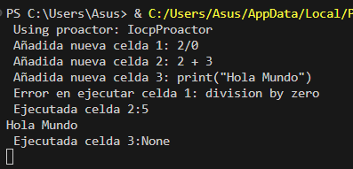
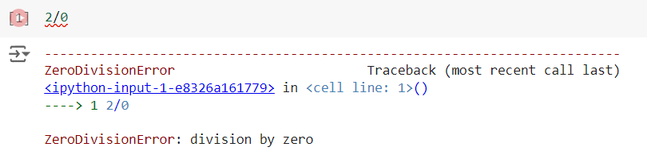

# **Implementa un sistema basado en eventos en Python que simule cómo los Jupyter Notebooks manejan eventos e interacciones de usuario. Esto incluye crear un bucle de eventos, manejar diferentes tipos de eventos y actualizar el estado de un notebook simulado basado en interacciones de usuario.**

#### Caracteristicas:
- Manejo asíncrono de la ejecución de celdas y eventos utilizando asyncio.
- Implementación de mecanismos de manejo de errores y registro de logs para diferentes tipos de errores.
- Operaciones seguras en los hilos al acceder a recursos compartidos.
- Sistema de filtrado y priorización de eventos según su importancia o tipo.


### Implementación:

- **Uso de asyncio para ejecución asíncrona:**

El código utiliza asyncio para manejar la ejecución asíncrona de las celdas y el bucle de eventos.
Las celdas se ejecutan de forma asíncrona con la función ejecuta_celda, que simula el tiempo de ejecución con await asyncio.sleep(2).

- **Manejo de errores y registro de logs:**

Se implementa el manejo de errores con bloques try-except dentro de la función ejecuta_celda.
Los errores se registran usando logging.error.
El formato de logs y el nivel de detalle se configuran al inicio con logging.basicConfig.

- **Operaciones seguras en hilos:**

Se utiliza un threading.Lock para asegurar que las operaciones que acceden a los recursos compartidos (las celdas) sean seguras y no provoquen condiciones de carrera.
Se asegura el acceso seguro a las celdas al agregar y modificar celdas dentro de un bloque with self.lock.

- **Sistema para filtrar y priorizar eventos:**

Se utiliza una PriorityQueue para manejar la cola de eventos, permitiendo la priorización de eventos según su importancia.
Los eventos se agregan a la cola con el método add_evento, que toma una prioridad y un evento.


## Estructura del codigo:

#### **Configuración del Logging**

Para implementar el registro de logs para diferentes tipos de errores como cuando hay división entre 0, entre otros.
Para ello, configuramos el logging para registrar mensajes  para registrar mensajes con diferentes niveles de severidad, en el siguiente codigo se esta definiendo que el formato el registro de log que mostrará el mensaje con "format=' %(message)s'".:

```
logging.basicConfig(level=logging.DEBUG, format=' %(message)s')

```

Cabe mencionar que un log son archivos que registran eventos especificos dentro del sistema que en este caso van a permitir identificar errores en el codigo al añadir celdas y al ejecutar dichas celdas.

#### **Definición de la Clase Jupyter_Notebook**

La clase Jupyter_Notebook maneja la lista de celdas y la cola de eventos con prioridad.

**Inicialización**

```
class Jupyter_Notebook:
    def __init__(self):
        self.celdas = []
        self.evento_prio = PriorityQueue()
        self.lock = threading.Lock()

```

**Ejecución de Celdas**

Corrutina para ejecutar una celda

```
async def ejecuta_celda(self, celda):
    try:
        await asyncio.sleep(2)  # Simula el tiempo de ejecución de la celda
        resultado = eval(celda['code'])  # Evalúa el código de la celda
        with self.lock:
            celda['output'] = resultado
            logging.debug(f"Ejecutada celda {celda['id']}:{resultado}")
    except Exception as e:
        logging.error(f"Error en ejecutar celda {celda['id']}: {e}")

```

**Añadir Celda**

Método para añadir una celda a la lista de celdas:

```
def add_celda(self, codigo):
    with self.lock:
        celda_id = len(self.celdas) + 1
        celda = {'id': celda_id, 'code': codigo, 'output': None}
        self.celdas.append(celda)
        logging.debug(f"Añadida nueva celda {celda_id}: {codigo}")

```

**Manejar Eventos**

Método para manejar eventos de adición y ejecución de celdas:

```
def manejar_eventos(self, evento):
    try:
        if evento['type'] == 'execute':
            celda_id = evento['celda_id']
            with self.lock:
                celda = next((c for c in self.celdas if c['id'] == celda_id), None)
            if celda:
                asyncio.create_task(self.ejecuta_celda(celda))
        elif evento['type'] == 'add_cell':
            code = evento['code']
            self.add_celda(code)
        else:
            logging.error(f"Tipo de evento desconocido {evento['type']}")
    except Exception as e:
        logging.error(f"Error en manejar el evento {evento['type']}: {e}")

```

**Bucle de Eventos**

Corrutina para obtener y manejar eventos de la cola de eventos:

```
async def event_loop(self):
    while True:
        prioridad, evento = await self.obtener_evento()
        self.manejar_eventos(evento)
```


**Obtener Evento**

Corrutina para obtener el siguiente evento de la cola:

```
async def obtener_evento(self):
    loop = asyncio.get_running_loop()
    return await loop.run_in_executor(None, self.evento_prio.get)

```

**Añadir Evento**

Método para añadir eventos a la cola de eventos con prioridad:

```
def add_evento(self, prioridad: int, event):
    self.evento_prio.put((prioridad, event))

```

#### **Manejo de Errores**

Los errores se manejan utilizando try-except y se registran con logging.error:

```
try:
    await asyncio.sleep(2)
    resultado = eval(celda['code'])
    with self.lock:
        celda['output'] = resultado
        logging.debug(f"Ejecutada celda {celda['id']}:{resultado}")
except Exception as e:
    logging.error(f"Error en ejecutar celda {celda['id']}: {e}")

```


#### **Ejemplo de simulación de interacciones de usuario**

Corrutina main para añadir eventos a la cola y ejecutar el bucle de eventos:

```
async def main():
    jupy_notebook = Jupyter_Notebook()

    # Agregar eventos con diferentes prioridades y tipos
    jupy_notebook.add_evento(2,{'type': 'add_cell', 'code': 'print("Hola Mundo")'})
    jupy_notebook.add_evento(3,{'type': 'execute', 'celda_id': 1})
    jupy_notebook.add_evento(1,{'type': 'add_cell', 'code': '2 + 3'})
    jupy_notebook.add_evento(4,{'type': 'execute', 'celda_id': 2})
    jupy_notebook.add_evento(0,{'type': 'add_cell', 'code': '2/0'})
    jupy_notebook.add_evento(5,{'type': 'execute', 'celda_id': 3})

    await jupy_notebook.event_loop()

if __name__ == "__main__":
    asyncio.run(main()) # Inicia el bucle de eventos del jupyter_notebook

```

#### **RESULTADOS:**



#### **Análisis del Ejemplo de Uso:**

**Prioridad y Orden de Ejecución:**

- Los eventos se agregan a la cola con diferentes prioridades.
- La celda con la división 2/0 (prioridad 0) se agrega primero, seguida de 2 + 3 (prioridad 1) y finalmente print("Hola Mundo") (prioridad 2).

- La ejecución de las celdas sigue el orden de prioridad, primero ejecutando la celda con la división por cero, luego 2 + 3 y finalmente print("Hola Mundo").


**Manejo de Errores:**

El código muestra el error de división por cero igual como pasaria en Jupyter Notebook (ver Figura 1) y lo hace mediante la excepción de división por cero y registra el error en los logs.

La salida muestra el mensaje de error Error en ejecutar celda 1: division by zero



*Figura 1: División entre 0 Jupyter Notebook*

**Salida:**

- La ejecución de la celda 2 + 3 devuelve 5, que se registra en los logs.

- La celda con print("Hola Mundo") se ejecuta y la salida Hola Mundo se imprime en la consola. La salida es None porque la celda print("Hola Mundo") no devuelve ningún valor.


