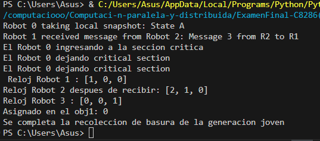

## **Crea un sistema de coordinación de tareas en una red de robots industriales:**

- Usa el algoritmo de Chandy-Lamport para tomar instantáneas del estado global de los robots durante la ejecución de n tareas.

- Implementa el algoritmo de Raymond para la exclusión mutua en el acceso a recursos
compartidos entre los robots.

- Utiliza relojes vectoriales para asegurar el ordenamiento parcial de los eventos y detectar violaciones de causalidad.

- Integra un recolector de basura generacional para la gestión eficiente de la memoria en los nodos de control de los robots.


En este ejercicio se implementó un sistema de coordinación de tareas para una red de robots industriales, utilizando varios algoritmos para asegurar la sincronización, la exclusión mutua y la gestión eficiente de recursos y memoria.

#### **Funcionamiento Integrado:**

**Inicio y Sincronización:**

- Todos los robots inician sus tareas simultáneamente.
- Cada robot comienza a actualizar su estado interno y sus relojes vectoriales a medida que avanza en la ejecución de sus tareas.

**Toma de Instantáneas:**

- **Algoritmo de Chandy-Lamport**
El algoritmo de Chandy-Lamport permite a los robots tomar instantáneas globales del estado del sistema durante la ejecución de tareas. Ocurre lo siguiente:

- Un robot decide tomar una instantánea global del sistema usando el algoritmo de Chandy-Lamport.
- Envía marcadores a todos sus vecinos para iniciar el proceso de captura de instantáneas.
- Cada robot, al recibir un marcador, registra su estado local y pasa el marcador a sus vecinos, asegurando que todos los robots capturen un estado coherente del sistema en ese momento.

```
class Process:
    def __init__(self, process_id):
        self.process_id = process_id
        self.state = None
        self.channels = defaultdict(list)
        self.neighbors = []
        self.marker_received = {}
        self.local_snapshot = None
        self.lock = threading.Lock()

    def set_neighbors(self, neighbors):
        self.neighbors = neighbors
        for neighbor in neighbors:
            self.marker_received[neighbor.process_id] = False

    # Inicia una instantánea local del proceso
    def initiate_snapshot(self):
        with self.lock:
            self.local_snapshot = self.state
            print(f"Process {self.process_id} taking local snapshot: {self.local_snapshot}")

    # Envía mensajes marcadores a los procesos vecinos
    def send_marker_messages(self):
        for neighbor in self.neighbors:
            self.send_message(neighbor, 'MARKER')

    def send_message(self, neighbor, message_type, content=None):
        message = (message_type, self.process_id, content)
        neighbor.receive_message(message)

    # Recibe mensajes y procesa marcadores
    def receive_message(self, message):
        message_type, sender_id, content = message
        with self.lock:
            if message_type == 'MARKER':
                if not self.marker_received[sender_id]:
                    self.marker_received[sender_id] = True
                    if self.local_snapshot is None:
                        self.local_snapshot = self.state
                        print(f"Process {self.process_id} taking local snapshot: {self.local_snapshot}")
                        self.send_marker_messages()
                    else:
                        self.channels[sender_id].append(content)
                else:
                    self.channels[sender_id].append(content)
            else:
                if self.local_snapshot is not None:
                    self.channels[sender_id].append(content)
                else:
                    self.process_message(message)

    def process_message(self, message):
        # Simulate processing of a normal message
        print(f"Process {self.process_id} received message from Process {message[1]}: {message[2]}")

    def update_state(self, new_state):
        self.state = new_state
```
**Exclusión Mutua con el Algoritmo de Raymond:**
El algoritmo de Raymond garantiza la exclusión mutua entre los robots al acceder a recursos compartidos. 

- Mientras los robots realizan sus tareas, pueden necesitar acceso exclusivo a recursos compartidos.
- Utilizan el algoritmo de Raymond para coordinar el acceso a secciones críticas.
- El robot que necesita acceder a un recurso crítico envía una solicitud al robot que actualmente posee el token.
- El token se transfiere al robot solicitante, permitiéndole el acceso exclusivo al recurso hasta que termine su tarea y libera el recurso.

```
class RaymondMutex:
    def __init__(self, node_id, parent=None):
        self.node_id = node_id
        self.parent = parent
        self.token_holder = (parent is None)
        self.request_queue = []

    def request_access(self):
        # Solicita acceso al recurso crítico
        if self.token_holder:
            self.enter_critical_section()
        else:
            self.request_queue.append(self.node_id)
            self.send_request_to_parent()

    def send_request_to_parent(self):
        if self.parent:
            self.parent.receive_request(self)

    def receive_request(self, requester):
        # Recibe solicitudes y maneja el envío del token
        if not self.token_holder:
            self.request_queue.append(requester.node_id)
            self.send_request_to_parent()
        elif requester.node_id == self.node_id:
            self.enter_critical_section()
        else:
            self.send_token(requester)

    def send_token(self, requester):
        self.token_holder = False
        requester.receive_token(self)

    def send_token_to_next_in_queue(self):
        next_node_id = self.request_queue.pop(0)
        next_node = [node for node in nodes if node.node_id == next_node_id][0]
        self.send_token(next_node)

    def enter_critical_section(self):
        # Entra a la sección crítica
        print(f"El Robot {self.node_id} ingresando a la seccion critica")
        self.leave_critical_section()

    def leave_critical_section(self):
         # Sale de la sección crítica y pasa el token si es necesario
        print(f"El Robot {self.node_id} dejando critical section")
        if self.request_queue:
            self.send_token_to_next_in_queue()

```

**Ordenamiento de Eventos con Relojes Vectoriales**
Los relojes vectoriales aseguran el ordenamiento parcial de eventos y la detección de violaciones de causalidad entre los robots.

- Cada robot mantiene un reloj vectorial que se actualiza con cada evento local y cada mensaje recibido.
- Al enviar un mensaje o evento, un robot adjunta su estado de reloj vectorial actualizado.
- Al recibir un mensaje con un estado de reloj vectorial, el robot combina su propio estado de reloj con el recibido, asegurando un orden parcial entre eventos en diferentes robots.
- Esto permite a los robots detectar dependencias causales entre eventos y mantener una visión coherente del orden de los eventos en el sistema.

```
class VectorClock:
    def __init__(self, num_nodes, node_id):
        self.clock = [0] * num_nodes
        self.node_id = node_id

    def tick(self):
        self.clock[self.node_id] += 1

    def send_event(self):
        # Simula el envío de un evento y actualiza el reloj
        self.tick()
        return self.clock[:]

    def receive_event(self, received_vector):
        # Recibe un evento y actualiza el reloj vectorial
        for i in range(len(self.clock)):
            self.clock[i] = max(self.clock[i], received_vector[i])
        self.clock[self.node_id] += 1
```


**Gestión de Memoria con Recolector de Basura Generacional:**
El recolector de basura generacional optimiza el uso de memoria en los nodos de control de los robots.

- Para optimizar el uso de memoria, cada robot implementa un recolector de basura generacional.
- Los objetos se asignan inicialmente a una generación joven.
- Cuando la generación joven se llena, se inicia una recolección de basura donde los objetos vivos se mueven a la generación vieja.
- Periódicamente, se recolecta la generación vieja para liberar objetos que ya no se utilizan, asegurando una gestión eficiente y optimizada de la memoria.


```
class GenerationalCollector:
    def __init__(self, size):
        # Inicializa el colector generacional con dos generaciones: joven y vieja
        self.size = size
        self.young_gen = [None] * size  
        self.old_gen = [None] * size    
        self.young_ptr = 0  
        self.old_ptr = 0    

    def allocate(self, obj, old=False):
        # Asigna un objeto en la generación especificada (joven por defecto)
        if old:
            # Asignación en la generación vieja
            if self.old_ptr >= self.size:
                # Si la generación vieja está llena, recolectar basura
                self.collect_old()
            addr = self.old_ptr
            self.old_gen[addr] = obj
            self.old_ptr += 1
        else:
            # Asignación en la generación joven
            if self.young_ptr >= self.size:
                # Si la generación joven está llena, recolectar basura
                self.collect_young()
            addr = self.young_ptr
            self.young_gen[addr] = obj
            self.young_ptr += 1
        return addr


    def collect_young(self):
        self.old_gen = self.old_gen + [obj for obj in self.young_gen if obj is not None]

        # Reinicia la generación joven
        self.young_gen = [None] * self.size
        self.young_ptr = 0

    def collect_old(self):
        # Recolección de basura en la generación vieja
        self.old_gen = [obj for obj in self.old_gen if obj is not None]
        self.old_ptr = len(self.old_gen)
        # Ajusta el tamaño de la generación vieja al tamaño original
        self.old_gen += [None] * (self.size - self.old_ptr)
```


### **Integración y Ejecución del Sistema**

El sistema integra todos estos componentes para coordinar las tareas entre los robots industriales, asegurando la toma de instantáneas, la exclusión mutua, el ordenamiento de eventos y la gestión eficiente de memoria.

```
#Sistema de coordinación de tareas en una red de robots industriales
if __name__=='__main__':

    #Instantáneas del estado global de los robots durante la ejecución de n tareas
    #En este caso 3 tareas
    processes = [Process(i) for i in range(3)]
    for i, process in enumerate(processes):
        neighbors = [p for j, p in enumerate(processes) if i != j]
        process.set_neighbors(neighbors)

    
    processes[0].update_state("State A")
    processes[1].update_state("State B")
    processes[2].update_state("State C")
    # Ejecución de toma de instantáneas
    processes[0].initiate_snapshot()

    time.sleep(1)
    processes[1].send_message(processes[0], 'MESSAGE', "Message 1 from P1 to P0")
    time.sleep(1)
    processes[2].send_message(processes[0], 'MESSAGE', "Message 2 from P2 to P0")
    time.sleep(1)
    processes[2].send_message(processes[1], 'MESSAGE', "Message 3 from P2 to P1")
    

    #Cordinación de recursos compartidos
    nodes = [RaymondMutex(i) for i in range(3)]
    nodes[0].parent = nodes[1]
    nodes[1].parent = nodes[2]

    # Simular que robot 0 quiere ingresar a la secciòn critica
    nodes[0].request_access()
    time.sleep(2)
    nodes[0].leave_critical_section()
        
    #Actualiza cada robot para mantener y utlizar relojes en la comunicación
    num_nodes = len(nodes)
    node1 = VectorClock(num_nodes, 0)
    node2 = VectorClock(num_nodes, 1)
    node3 = VectorClock(num_nodes, 2)

    # Evento en el nodo 1
    node1.tick()
    print(f" Reloj Robot 1 : {node1.clock}")

    # Ejecución de relojes vectoriales
    # Nodo 1 envía un mensaje a nodo 2
    msg = node1.send_event()
    node2.receive_event(msg)
    print(f"Reloj Robot 2 despues de recibir: {node2.clock}")

    # Evento en el nodo 3
    node3.tick()
    print(f"Reloj Robot 3 : {node3.clock}")
    
    #Gestión eficiente de la memoria en los nodos de control de los robots.
    # Ejecución de recolector de basura generacional
    collector = GenerationalCollector(10)
    addr1 = collector.allocate("obj1")
    print(f"Asignado en el obj1: {addr1}")
    collector.collect_young()
    print("Se completa la recoleccion de basura de la generacion joven")

```

##### **Resultados:**




##### **Análisis de resultados**

- Robot 0 toma una instantánea local de su estado, mostrando "State A". Esto indica que capturó su estado interno.
- El Robot 1 recibió un mensaje del Robot 2 con el contenido "Message 3 from R2 to R1". Esto demuestra la comunicación entre los robots durante la ejecución de tareas.

- Después, el Robot 0 decide requiere ingresar al recurso crítico, entonces, este robot envía una solicitud al robot que actualmente posee el token.
- Cuando el Robot 0 adquiere el token puede hacer uso del recurso crítico, después, de terminar su tarea y deja la sección critica.

- Por otra parte, cada robot mantiene su reloj vectorial que se actualiza en cada evento. En este caso, los relojes vectoriales reflejan los eventos ocurridos y se sincronizan entre los robots. Además, de detectar y mantener la casualidad entre eventos. En este caso no hay violaciones de casualidad, es decir, que no hay dos eventos que tienen el orden incorrecto. 

- Por ultimo, se realiza la recolección de basura geracional en este caso la generación joven, de esta forma, asegurando que la memoria se libere correctamente de los objetos que ya no se necesitan.


