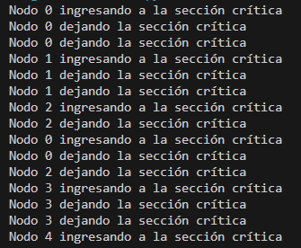
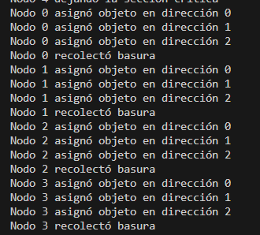
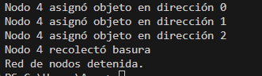

## **Implementa un sistema distribuido en Python para la ejecución de tareas científicas en una red de computadoras, utilizando los siguientes algoritmos:**

Descripción detallada del sistema distribuido implementado para ejecutar tareas científicas en una red de computadoras. El sistema utiliza varios algoritmos clave para garantizar la exclusión mutua, la detección de terminación de procesos, la sincronización de relojes y la gestión de la memoria. 

### **Estructura del Código**

El código está organizado en varias clases que representan los componentes principales del sistema distribuido:

### **Clase `Message`**

La clase `Message` representa un mensaje enviado entre nodos dentro de la red. Donde tendra los siguientes atributos  para el remitente (sender), el contenido (content) y la marca de tiempo (timestamp).

```
class Message:
    def __init__(self, sender, content, timestamp):
        self.sender = sender
        self.content = content
        self.timestamp = timestamp

```

### **Clase Node**

La clase Node representa un nodo en la red de computadoras, cada uno de estos nodos tendra un identificador (nodo_id), el número total de nodos en la red (total_nodes), y una referencia a la red.

Dentro desta clase se encuentra el algoritmo Ricart-Agrawala que permitirá manejar solicitudes de exclusión mutua, lo que va evitar lo que son los interbloqueos al momento de ingresar a la sección critica. Este algoritmo lo que va hacer este va hacer es lo siguiente:
Supongamos que el Nodo1 desea acceder a la sección critica, este nodo va enviar mensajes de solicitud de acceso a todos los demás nodos y esperan respuestas antes de acceder al recurso crítico. Garantizando que no haya interbloqueo.

```
# Algoritmo de Dijkstra-Scholten :

class Process:
    def __init__(self, process_id, neighbors):
        self.process_id = process_id
        self.neighbors = neighbors
        self.parent = None
        self.children = set()
        self.active = True

    def send_message(self, recipient):
        recipient.receive_message(self, self.process_id)

    def receive_message(self, sender, sender_id):
        if self.parent is None:
            self.parent = sender
        self.children.add(sender_id)
        self.process_task()

    def process_task(self):
        # Simulate task processing
        self.active = False
        self.check_termination()

    def check_termination(self):
        if not self.active and not self.children:
            if self.parent:
                self.parent.receive_termination(self.process_id)

    def receive_termination(self, child_id):
        self.children.remove(child_id)
        self.check_termination()

```

Asimismo, se hizo uso del algoritmo Dijkstra-Scholten para detectar la terminación de procesos distribuidos. Este algoritmo lo que va hacer es asegurar que todos los nodos han terminado antes de decharar la terminación global.


```
#Algoritmo RicartAgrawalaMutex

class RicartAgrawalaMutex:
    def __init__(self, node_id, num_nodes, network):
        self.node_id = node_id
        self.num_nodes = num_nodes
        self.clock = 0  # Reloj lógico del nodo
        self.request_queue = []  # Cola de solicitudes de acceso
        self.replies_received = 0  # Contador de respuestas recibidas
        self.network = network  # Referencia a la red de nodos

    def request_access(self):
        self.clock += 1  # Incrementa el reloj lógico antes de enviar la solicitud
        self.request_queue.append((self.clock, self.node_id))  # Añade la solicitud a la cola de solicitudes
        # Envía una solicitud de acceso a todos los demás nodos
        for node in self.network.nodes:
            if node.node_id != self.node_id:
                node.receive_request(self.clock, self.node_id)

    def receive_request(self, timestamp, sender_id):
        self.clock = max(self.clock, timestamp) + 1  # Actualiza el reloj lógico del nodo
        self.request_queue.append((timestamp, sender_id))  # Añade la solicitud a la cola de solicitudes
        self.request_queue.sort()  # Ordena la cola de solicitudes por timestamp
        self.send_reply(sender_id)  # Envía una respuesta al nodo solicitante

    def send_reply(self, target_id):
        for node in self.network.nodes:
            if node.node_id == target_id:
                node.receive_reply(self.node_id)  # Envía la respuesta al nodo destinatario

    def receive_reply(self, sender_id):
        self.replies_received += 1  # Incrementa el contador de respuestas recibidas
        # Si ha recibido respuestas de todos los demás nodos, ingresa a la sección crítica
        if self.replies_received == self.num_nodes - 1:
            self.enter_critical_section()

    def enter_critical_section(self):
        print(f"Nodo {self.node_id} ingresando a la sección crítica en el tiempo {self.clock}")
        self.leave_critical_section()

    def leave_critical_section(self):
        self.replies_received = 0  # Reinicia el contador de respuestas recibidas
        # Filtra la cola de solicitudes para eliminar la solicitud del propio nodo
        self.request_queue = [(t, n) for t, n in self.request_queue if n != self.node_id]
         # Verifica si hay nodos en la cola de solicitudes restantes para enviar respuestas
        if self.request_queue:
            timestamp, node_id = self.request_queue[0]  # Obtiene la primera solicitud en la cola
            self.send_reply(node_id)

        print(f"Nodo {self.node_id} dejando la sección crítica en el tiempo {self.clock}")


```

Para la sincronización de Relojes se implementa una sincronización basica de relojes entre los nodos para asegurar una vista consistente del tiempo. En este caso se hizo uso de Ordenamiento de Lamport para establecer un orden parcial de eventos en un sistema distribuido basado en la relación de suceso anterior. Este algoritmo hace uso de relojs logicos para asignar marcas de tiempo a los eventos. 

```
def receive_message(self, message):
        self.clock = max(self.clock, message.timestamp) + 1
        print(f"Mensaje recibido en Nodo {self.node_id}: {message.content}")

```

Asimismo, se hizo uso del algoritmo de Cheney para realizar la recoleccion de basura, lo que hace este algoritmo es divir la memoria en dos semiespacios, al momento de la recolección este va a copiar los objetos vivos del semiespacio actual al otro semiespacio, de esta forma gestionar la memoria en los nodos de computación.

```
# Algoritmo de recolección de basura (Cheney)

class CheneyCollector:
    def __init__(self, size):
        self.size = size
        self.from_space = [None] * size
        self.to_space = [None] * size
        self.free_ptr = 0

    def allocate(self, obj):
        if self.free_ptr >= self.size:
            self.collect()
        addr = self.free_ptr
        self.from_space[addr] = obj
        self.free_ptr += 1
        return addr

    def collect(self):
        self.to_space = [None] * self.size
        self.free_ptr = 0
        for obj in self.from_space:
            if obj is not None:
                self.copy(obj)
        self.from_space, self.to_space = self.to_space, self.from_space

    def copy(self, obj):
        addr = self.free_ptr
        self.to_space[addr] = obj
        self.free_ptr += 1
        return addr

```

Obteniendo de esta forma la clase Node:

```
class Node:
    def __init__(self, node_id, total_nodes, network):
        self.node_id = node_id
        self.total_nodes = total_nodes
        self.network = network
        self.clock = 0
        self.mutex = RicartAgrawalaMutex(node_id, total_nodes, network)
        self.processes = {}

    def send_message(self, recipient_id, content):
        message = Message(self.node_id, content, self.clock)
        recipient_node = self.network.get_node_by_id(recipient_id)
        recipient_node.receive_message(message)


    def send_reply(self, target_id):
        for node in self.network.nodes:
            if node.node_id == target_id:
                node.receive_reply(self.node_id)

    def receive_message(self, message):
        self.clock = max(self.clock, message.timestamp) + 1
        print(f"Mensaje recibido en Nodo {self.node_id}: {message.content}")

    def request_cs(self):
        self.mutex.request_access()

    def receive_request(self, request_clock, request_node_id):
        self.mutex.receive_request(request_clock, request_node_id)

    def receive_reply(self, sender_id):
        self.mutex.receive_reply(sender_id)

    def release_cs(self):
        self.mutex.leave_critical_section()

    def synchronize_clocks(self):
        # Implementación básica de sincronización de relojes
        max_clock = max([node.clock for node in self.network.nodes])
        self.clock = max_clock

    def garbage_collect(self):
        # Implementación básica de recolección de basura utilizando el algoritmo de Cheney
        collector = CheneyCollector(size=100)  # Tamaño de la memoria ficticio
        # Simulación de asignación y recolección de memoria
        for i in range(3):  # Simular 3 asignaciones
            addr = collector.allocate(f"Objeto {i}")
            print(f"Nodo {self.node_id} asignó objeto en dirección {addr}")
        collector.collect()
        print(f"Nodo {self.node_id} recolectó basura")

    def terminate_process_detection(self):
        # Implementación básica de detección de terminación de procesos distribuidos
        if not self.processes:
           return
        active_processes = [p for p in self.processes.values() if p.active]
        if not active_processes:
            print(f"Nodo {self.node_id}: Todos los procesos han terminado.")

    def add_process(self, process_id, neighbors):
        self.processes[process_id] = Process(process_id, neighbors)

    def start_processes(self):
        for process in self.processes.values():
            process.send_message(process.neighbors[0])

    def receive_process_message(self, sender_id, process_id):
        if process_id not in self.processes:
            self.add_process(process_id, neighbors=[sender_id])
        else:
            self.processes[process_id].send_message(self, sender_id)

    def remove_process(self, process_id):
        del self.processes[process_id]

```
### **Clase  Network**

Después, se creó la clase Network que se va encargar de manejar la creación y la coordinación de los nodos en la red.
En esta clase de manejo la creación y coordinación de los nodos en la red, asimismo, se implemento métodos para iniciar y detener la red de nodos.

Después de ello se realizó una simulación de tareas científicas:

Que tiene las siguientes caracteristicas: 
• Sincroniza los relojes de los nodos.
• Realiza solicitudes de exclusión mutua para acceder a recursos compartidos.
• Realiza la recolección de basura en los nodos.
• Detiene la red de nodos de manera ordenada.


```
class Network:
    def __init__(self, num_nodes):
        self.num_nodes = num_nodes
        self.nodes = [Node(node_id, num_nodes, self) for node_id in range(num_nodes)]

    def get_node_by_id(self, node_id):
        return self.nodes[node_id]

    def start_network(self):
        for node in self.nodes:
            node.start_processes()

    def stop_network(self):
        for node in self.nodes:
            node.terminate_process_detection()
            node.garbage_collect()
        print("Red de nodos detenida.")

    def simulate_tasks(self):
        # Sincronizar los relojes de los nodos
        for node in self.nodes:
            node.synchronize_clocks()

        # Realizar solicitudes de exclusión mutua para acceder a recursos compartidos
        for node in self.nodes:
            node.request_cs()
            # Simular operaciones críticas aquí
            node.release_cs()

        # Realizar la recolección de basura en los nodos
        for node in self.nodes:
            node.garbage_collect()
            

        # Detener la red de nodos de manera ordenada
        self.stop_network()

```


### **Análisis de resultados**

**RESULTADOS**


En los resultados podemos observar como funciona el acceso a la sección crítica entre los nodos en un orden, asimismo, se muestra como estos nodos dejan de usar esta sección dejando que otros nodos lo utilice.




Por otra parte, se obtuvo la asignación de objetos y la recolección de Basura, asignando a cada nodo tres direcciones. Después, de la asignación pasa a la recolección de basura, de esta forma, obteniendo el sistema limpio y gestionando la memoria en los nodos de computación.




Por ultimo, se obtine el mensaje "Red de nodos detenida" indica que la ejecución de los nodos a sido detenida.

