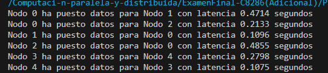
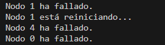
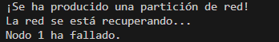

## **Implementar un sistema distribuido en Python que simule las tres propiedades del Teorema CAP: consistencia, disponibilidad y tolerancia a particiones. El sistema debe demostrar cómo se comporta bajo diferentes configuraciones.**

En el código debes incluir:
- La simulación de latencia de red en la comunicación entre nodos.
- Un algoritmo de consenso sencillo como Raft o Paxos para gestionar la consistencia.
- Fallos aleatorios en los nodos para simular fallos de red o nodos caídos.
- Registros de operaciones y versiones de datos para gestionar la consistencia eventual.
- Diferentes configuraciones de particiones y curaciones en la red.


### **Estructura del codigo:**

Primero se realizó una estructura que simula la conección entre nodos 

```
connected_nodes = {
    0: [1, 2],
    1: [0],
    2: [0],
    3: [4],
    4: [3]
}

```
Esta estructura define las conexiones entre los nodos simulados. Por ejemplo, el nodo 0 está conectado con los nodos 1 y 2, y así sucesivamente.

Después de ello, esta la simulación de latencia de red:

```
# Simular latencia de red aleatoria
def latencia_red():
    latencia = random.uniform(0.1, 0.5)
    time.sleep(latencia)
    return latencia
```

Esta función latencia_red() introduce un retraso aleatorio para simular la latencia de red entre los nodos para entender cómo la latencia afecta la consistencia y la disponibilidad del sistema distribuido.

- Algoritmo de Replicación de Datos (Consistencia Eventual)

```
# Algoritmo de replicación de datos entre nodos (consistencia eventual)
class Node:
    def __init__(self, node_id):
        self.node_id = node_id
        self.data = {}
        self.log = []

    def put(self, key, value):
        latency = simulate_network_latency()
        self.data[key] = value
        self.log.append((key, value))
        print(f"Nodo {self.node_id} ha puesto datos para Nodo {key[-1]} con latencia {latency:.4f} segundos")

    def replicate(self, other_node):
        for entry in self.log:
            other_node.data[entry[0]] = entry[1]
        other_node.log.extend(self.log)
```

La clase Node y el método replicate() tiene el funcionamiento de replicación de datos para lograr consistencia eventual entre los nodos. Los datos se colocan en el nodo local (put()) y luego se replican en otros nodos cuando sea posible.

**Implementación Básica de Raft para Consenso Distribuido**

```
# Implementación básica de Raft para consenso distribuido
class RaftNode(Node):
    def __init__(self, node_id):
        super().__init__(node_id)
        self.current_term = 0
        self.voted_for = None
        self.log = []

    def request_vote(self, term, candidate_id):
        if term > self.current_term:
            self.current_term = term
            self.voted_for = candidate_id
            return True
        return False

    def append_entries(self, term, leader_id, prev_log_index, prev_log_term, entries, leader_commit):
        if term >= self.current_term:
            self.current_term = term
            self.log.extend(entries)
            return True
        return False

    def replicate(self, other_node):
        entries = []
        for entry in self.log:
            entries.append(entry)
            if len(entries) == 5:  # Simular replicación de lotes de entradas
                other_node.append_entries(self.current_term, self.node_id, 0, 0, entries, 0)
                entries = []
        if entries:
            other_node.append_entries(self.current_term, self.node_id, 0, 0, entries, 0)
```

Los métodos request_vote() y append_entries() manejan la elección de líder y la replicación de registros para mantener la consistencia y la disponibilidad del sistema.


**Simulación de Fallos de Red y Recuperación**

```
# Función para simular una partición de red
def simulate_particio_red():
    time.sleep(random.uniform(2, 5))
    print("¡Se ha producido una partición de red!")

# Función para simular la recuperación de la red
def simulate_recuperacion_red():
    time.sleep(random.uniform(2, 5))
    print("La red se ha recuperado.")
```
Estas funciones simulan escenarios de partición de red y recuperación, reflejando la tolerancia a particiones del sistema distribuido. 

**Ejecución de Nodos con Posibles Fallos**

```
# Función para ejecutar un nodo con posibles fallos
def nodos_posibles_fallos(node):
    while True:
        # Simular fallos aleatorios en el nodo
        time.sleep(random.uniform(1, 3))
        if random.random() < 0.3:  # Probabilidad de 30% de fallo
            print(f"Nodo {node.node_id} ha fallado.")
            time.sleep(random.uniform(1, 3))
            print(f"Nodo {node.node_id} está reiniciando...")
```

Esta función ejecuta nodos que pueden experimentar fallos aleatorios.


**Simulación de la Red Distribuida**

```
# Función para ejecutar la simulación de red
def simulacion(max_iterations):
    nodes = [RaftNode(i) for i in range(len(connected_nodes))]
    threads = []

    # Crear hilos para ejecutar nodos con posibles fallos
    for node in nodes:
        thread = threading.Thread(target=nodos_posibles_fallos, args=(node,))
        thread.start()
        threads.append(thread)

    # Iterar sobre un número máximo de iteraciones
    for _ in range(max_iterations):
        # Simular operaciones entre nodos conectados
        for node in nodes:
            for recipient_id in connected_nodes[node.node_id]:
                node.put(f'key{recipient_id}', f'value{recipient_id}')

        # Simular partición de red
        print("¡Se ha producido una partición de red!")
        simulate_particio_red()

        # Simular replicación de datos en nodos afectados
        for node in nodes:
            if node.node_id == 3:
                node.replicate(nodes[4])

        # Simular recuperación de la red
        print("La red se está recuperando...")
        simulate_recuperacion_red()

        time.sleep(2)  
```

Esta función ejecuta la simulación completa del sistema distribuido. Involucra la inicialización de nodos, la simulación de operaciones entre ellos, la gestión de fallos y recuperaciones de red, y la replicación de datos para mantener la consistencia y la disponibilidad.


**Ejecución de la Simulación**

```
if __name__ == "__main__":
    max_iterations = 5
    run_simulation(max_iterations)
```

### **Análisis de resultados**

**RESULTADOS**

Consistencia

En la simulación, los nodos Raft gestiona  la consistencia eventual mediante la replicación de logs. Cada nodo mantiene un registro de operaciones (log) que se utiliza para mantener un seguimiento de las entradas aplicadas. Cuando un nodo realiza una operación de escritura (put), esta se agrega al log y eventualmente se replica en otros nodos conectados. 



Disponibilidad

Tolerancia a Fallos: Los nodos pueden fallar aleatoriamente con una probabilidad del 30%. Cuando esto ocurre, el nodo deja de responder temporalmente y muestra un mensaje de fallo.

Después de una falla, los nodos intentan reiniciarse y recuperarse para volver a estar disponibles.




Tolerancia a Particiones

Manejo de Particiones: Cuando se produce una partición de red, se muestra un mensaje indicando que ha ocurrido una partición "¡Se ha producido una partición de red!" .

Después de una partición, se simula la recuperación de la red con un mensaje que indica que la red está recuperándose. 




Cada uno de estos aspectos ilustra el Teorema CAP, en escenarios prácticos de sistemas distribuidos, equilibrando la consistencia, la disponibilidad y la tolerancia a particiones de manera efectiva.